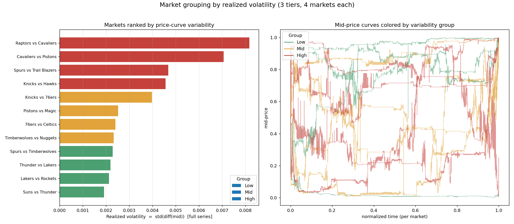
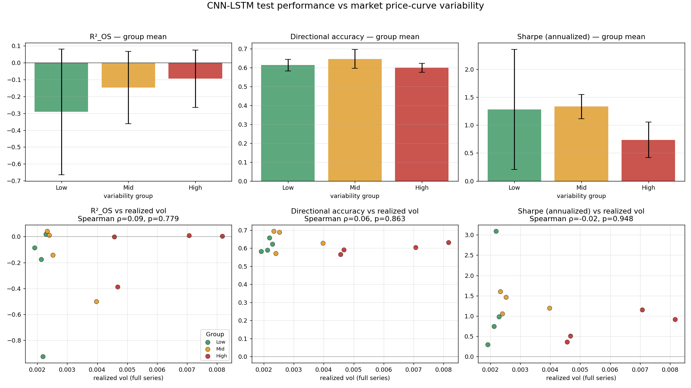

# 模型表现 vs 价格曲线波动性 — 分组对比报告

**问题:** 我们最好的 CNN-LSTM 在 12 个 NBA market 上联合训练。这 12 个 market 的 mid-price 曲线
形态差别很大(见 `viz_02_midprice_series.png`)。本报告检验一个假设:

- **H0(原假设):** 模型在 test 上的表现与 market 价格曲线的波动性**无关**。
- **H1(备择假设):** 模型表现**依赖于**波动性(在高/低波动 market 上系统性更好或更差)。

**一句话方法:** 按曲线波动性把 12 个 market 分成 低/中/高 三组,用**同一个**最佳 checkpoint 在
每个 market 的 test 集上单独测 metrics,再用组间对比 + Spearman 秩相关检验来回答上面的假设。

**结论速览:** 模型的核心能力指标(方向准确率 DirAcc、Sharpe)在三组之间**没有统计显著差异**
→ 在波动性这个维度上**不能拒绝 H0**,模型表现是稳健的。唯一显著的关系(R²_OS 与测试段波动性
正相关)主要是 R²_OS 这个指标在"安静测试段"上的分母放大效应,而非模型真的"更强"(见 §5)。

---

## 1. 这个 plan 是怎么做的(复现步骤)

| 步 | 做什么 | 脚本 / 产物 |
|---|---|---|
| 1 | **分组**:对每个 market 算 realized vol = `std(diff(mid))`(整条序列),排序后等分成 Low/Mid/High 三组(各 4 个) | `scripts/group_markets.py` → `market_groups.json`, `viz_08_market_groups.png` |
| 2 | **per-market 评估**:训练一次最佳配置(全 12 market),再用同一个 checkpoint 把 test 集**按 market 切开**分别算 metrics | `scripts/eval_per_market.sh`(`--per-market-eval`)→ run JSON 里的 `metrics["per_market"]` |
| 3 | **对比 + 检验**:join 分组与 per-market metrics → 组聚合 + Spearman 秩相关 → 出图与报告 | `scripts/analyze_market_groups.py` → `viz_09_group_comparison.png`, `MARKET_GROUP_ANALYSIS.md` |

**两个保证可比性的关键设计:**

1. **同一个模型**:不是每个 market 各训一个模型,而是用全 12 market 联合训练的那个最佳 checkpoint,
   逐 market 评估。这才是"大模型在不同曲线上的表现"。
2. **全局标准化 + 全局 naive baseline**:每个 market 的 target 标准化统计量(`t_mu/t_sigma`)和 R²_OS 的
   naive baseline(train mean)都**沿用全 12 market 训练集的全局值**,不在单个 market 上重算 —— 否则各
   market 的数字不可比。

**最佳配置(来自 `BEST_EXPERIMENT.md`):** stride5 + lr1e-3 + hidden64,seed=42,H100。

**波动性指标的含义:** realized vol 量的是**逐 tick 的抖动幅度**,正好是模型预测的对象(逐 tick mid 变化)
的波动;mid 是 0–1 概率,各 market 同单位可比。注意它量的不是"曲线整体摆幅"——所以像 Lakers vs Rockets
虽然在图里上下大摆,但因 tick 极多、单步变化小,落在 Low 组。

---

## 2. 分组结果(realized vol 三等分)

| 组 | market | realized_vol(整条) | vol(测试段) |
|---|---|---:|---:|
| **Low** | Suns vs Thunder | 0.00191 | 0.00040 |
| **Low** | Lakers vs Rockets | 0.00213 | 0.00089 |
| **Low** | Thunder vs Lakers | 0.00218 | 0.00043 |
| **Low** | Spurs vs Timberwolves | 0.00229 | 0.00127 |
| **Mid** | Timberwolves vs Nuggets | 0.00233 | 0.00267 |
| **Mid** | 76ers vs Celtics | 0.00240 | 0.00385 |
| **Mid** | Pistons vs Magic | 0.00252 | 0.00205 |
| **Mid** | Knicks vs 76ers | 0.00398 | 0.00033 |
| **High** | Knicks vs Hawks | 0.00456 | 0.00179 |
| **High** | Spurs vs Trail Blazers | 0.00467 | 0.00040 |
| **High** | Cavaliers vs Pistons | 0.00707 | 0.00745 |
| **High** | Raptors vs Cavaliers | 0.00817 | 0.02066 |

> 注意:整条序列波动和测试段波动对某些 market 差别很大(如 Raptors vs Cavaliers:整条 0.008、测试段 0.021;
> Spurs vs Trail Blazers:整条 0.0047、测试段 0.0004)。分组按整条序列定(market 的固有属性),但下面的
> 检验对**两种波动**各做一次。

---

## 3. Per-market test metrics

模型在每个 market 的 test 集上的三个指标(对 5 个 horizon 取均值,seed=42)。

| 组 | market | n_win | R²_OS | DirAcc | Sharpe |
|---|---|---:|---:|---:|---:|
| Low | Suns vs Thunder | 583 | −0.085 | 0.581 | 0.30 |
| Low | Lakers vs Rockets | 5,656 | −0.175 | 0.589 | 0.74 |
| Low | Thunder vs Lakers | 680 | −0.925 | 0.658 | 3.09 |
| Low | Spurs vs Timberwolves | 1,697 | 0.019 | 0.623 | 0.98 |
| Mid | Timberwolves vs Nuggets | 4,947 | 0.043 | 0.695 | 1.61 |
| Mid | 76ers vs Celtics | 3,953 | 0.010 | 0.572 | 1.06 |
| Mid | Pistons vs Magic | 3,568 | −0.143 | 0.689 | 1.46 |
| Mid | Knicks vs 76ers | 598 | −0.499 | 0.628 | 1.19 |
| High | Knicks vs Hawks | 1,744 | −0.002 | 0.566 | 0.36 |
| High | Spurs vs Trail Blazers | 1,723 | −0.389 | 0.592 | 0.51 |
| High | Cavaliers vs Pistons | 1,532 | 0.008 | 0.605 | 1.16 |
| High | Raptors vs Cavaliers | 3,934 | 0.002 | 0.632 | 0.92 |

**观察:** DirAcc 在所有 market 都在 **0.57–0.70**,稳稳高于 0.5 的随机基线;Sharpe 全为正。R²_OS 在多数
单 market 上为负(尤其测试段非常安静的 market,如 Thunder vs Lakers −0.92、Knicks vs 76ers −0.50)——
原因见 §5。

---

## 4. 组间对比 + Spearman 检验

### 4.1 组聚合(组均值)

| 组 | R²_OS | DirAcc | Sharpe | R²_OS(加权) | DirAcc(加权) | Sharpe(加权) |
|---|---:|---:|---:|---:|---:|---:|
| Low | −0.292 | 0.613 | 1.28 | −0.190 | 0.601 | 0.95 |
| Mid | −0.147 | 0.646 | 1.33 | −0.043 | 0.653 | 1.38 |
| High | −0.095 | 0.599 | 0.74 | −0.073 | 0.607 | 0.77 |

> 加权 = 按 test 窗口数加权。DirAcc 三组几乎一样(0.60–0.65);Sharpe 高波动组略低但区间重叠;
> R²_OS 三组都为负、且无单调趋势。

### 4.2 Spearman 秩相关(n=12,真正的统计检验)

把 12 个 market 按波动性排名,再按某个 metric 排名,看两个排名是否一致。ρ 接近 ±1 = 强相关,
p < 0.05 = 可拒绝 H0。**三个 metric 各做一次,对两种波动各做一次。**

#### Spearman ρ 是怎么算出来的

核心一句话:**Spearman = 把原始数值换成"名次(rank)"之后,再算 Pearson 相关系数。** 代码里就是
`scipy.stats.spearmanr(x, y)`(`scripts/analyze_market_groups.py` 第 177 行)。具体四步:

**第 1 步 — 各自独立排名。** 对波动性 x 和某个 metric y 分别在 12 个 market 上排名(谁第几大),只看名次、不看数值差多少。例如:

| market | x (vol) | y (metric) | rank(x) | rank(y) |
|---|---:|---:|---:|---:|
| A | 0.0019 | 0.581 | 1 | 2 |
| B | 0.0021 | 0.589 | 2 | 1 |
| C | 0.0035 | 0.605 | 3 | 3 |
| D | 0.0050 | 0.632 | 4 | 5 |
| E | 0.0082 | 0.628 | 5 | 4 |

**第 2 步 — 在名次上算 Pearson 相关。** 设 $R_x$ 、 $R_y$ 为名次,则

$$\rho = \frac{\operatorname{cov}(R_x, R_y)}{\sigma_{R_x}\,\sigma_{R_y}}$$

**第 3 步 — 没有并列(ties)时的简便公式。**

$$\rho = 1 - \frac{6\sum d_i^2}{n(n^2-1)}, \qquad d_i = R_{x_i} - R_{y_i}$$

其中 $d_i$ 是同一个 market 在两个变量上的名次差。以上表为例 $d = [-1,1,0,-1,1]$ ,故 $\sum d_i^2 = 4$ , $n = 5$ ,代入得 $\rho = 0.8$ 。有并列时 scipy 自动用"平均名次"并退回通用公式,所以直接调 `spearmanr` 最稳。

**第 4 步 — 取值范围 $[-1, +1]$ 。** $\rho = +1$ 为完全单调递增(x 越大 y 一定越大), $\rho = -1$ 为完全单调递减, $\rho = 0$ 表示名次间没有单调关系。

**为什么这里用 Spearman 而不是 Pearson:** ①它测的是**单调关系**而非线性关系,正好对应"波动越高、表现
是否系统性更好/更差"这个问题;②换成名次后对**异常值稳健**(一个极端值只是"排第 12 名",不会拉爆系数),
适合 Sharpe / 波动率这类有长尾的金融指标;③它是**非参数**方法,不要求双变量正态——n=12 根本无法验证正态性。
这也是用满 12 点做 Spearman 比切成三组(n=4)做 ANOVA 功效更高的原因:分组会丢掉组内的排序信息。

**p 值怎么读:** 原假设 H0 = 两变量名次间无单调关联(ρ=0)。p 小 → 拒绝 H0;p 大 → 证据不足(不等于"证明无关")。
注意 n=12 极小,p 值不稳、检验功效低,且这里对两种波动 × 三个 metric 反复检验存在**多重比较**问题,
所以结论以 ρ 的大小/符号 + 散点图为主,p 值作辅助(详见 §6)。

**vs 整条序列波动(= 分组用的那个):**

| Metric | Spearman ρ | p | 判定 |
|---|---:|---:|---|
| R²_OS | +0.091 | 0.779 | 不能拒绝 H0 |
| DirAcc | +0.056 | 0.863 | 不能拒绝 H0 |
| Sharpe | −0.021 | 0.948 | 不能拒绝 H0 |

**vs 测试段波动:**

| Metric | Spearman ρ | p | 判定 |
|---|---:|---:|---|
| R²_OS | **+0.783** | **0.003** | **拒绝 H0**:测试段越波动,R²_OS 越高 |
| DirAcc | +0.091 | 0.779 | 不能拒绝 H0 |
| Sharpe | +0.070 | 0.829 | 不能拒绝 H0 |

---

## 5. 结论与解读

**(1) 模型的核心能力(DirAcc、Sharpe)对波动性稳健 —— 不能拒绝 H0。**
无论用哪种波动度量,DirAcc 和 Sharpe 与波动性都**无显著相关**(p 全部 ≫ 0.05),而且 DirAcc 在
低/中/高三组都维持在 0.60–0.65。也就是说:**模型抓方向、做风险调整收益的能力,不会因为 market 曲线
波动大或小而系统性变好或变差。** 这其实是一个好结论 —— 说明模型的信号在不同形态的曲线上都站得住。

**(2) 唯一的显著关系(R²_OS vs 测试段波动)主要是指标的分母效应,不是"模型更强"。**
R²_OS 与测试段波动强正相关(ρ=0.78, p=0.003),但这很可能是 **R²_OS 这个指标本身的 scale 假象**:
R²_OS = 1 − MSE_model / MSE_naive。当测试段非常安静(波动极小),分母 MSE_naive 趋近 0,这个比值会被
急剧放大,R²_OS 就掉到很负(对应 Thunder vs Lakers、Knicks vs 76ers 这些测试段超安静、R² 极负的点)。
反过来测试段有波动时,模型有真实的方差可解释,R²_OS 才正常。所以这个相关性更多反映"测试段有多安静"
这个**数据属性**,而不是"模型在波动 market 上预测得更准"。因此跨 market 比较时,**DirAcc / Sharpe 比
R²_OS 更可靠**;R²_OS 适合在固定数据上比模型,不适合跨不同波动的 market 横比。

**总判定:** 在波动性这个维度上,**模型表现总体稳健,不能拒绝 H0**。组均值的差异(如高波动组 Sharpe 略低)
在 n=12 下不显著,应作为探索性观察。

---

## 6. 注意事项 / 局限

- **样本小(n=12 个 market)**:组内各 4 个,统计功效有限;Spearman 用满 12 点已是较有力的做法,但
  结论仍偏探索性。
- **单 seed(42)**:Sharpe 在 seed 间最 noisy。要更稳可跑多 seed:`bash scripts/eval_per_market.sh 42 0 7`,
  分析脚本会自动对 seed 求平均并在图上画误差棒。
- **R²_OS 跨 market 不可直接横比**(见 §5),解读时以 DirAcc / Sharpe 为主。
- **整条序列波动 ≠ 曲线整体摆幅**:realized vol 量的是逐 tick 抖动,不是价格 range。

---

*复现:`python scripts/group_markets.py` → `bash scripts/eval_per_market.sh` →
`python scripts/analyze_market_groups.py`。自动版数字表见 `MARKET_GROUP_ANALYSIS.md`。*
