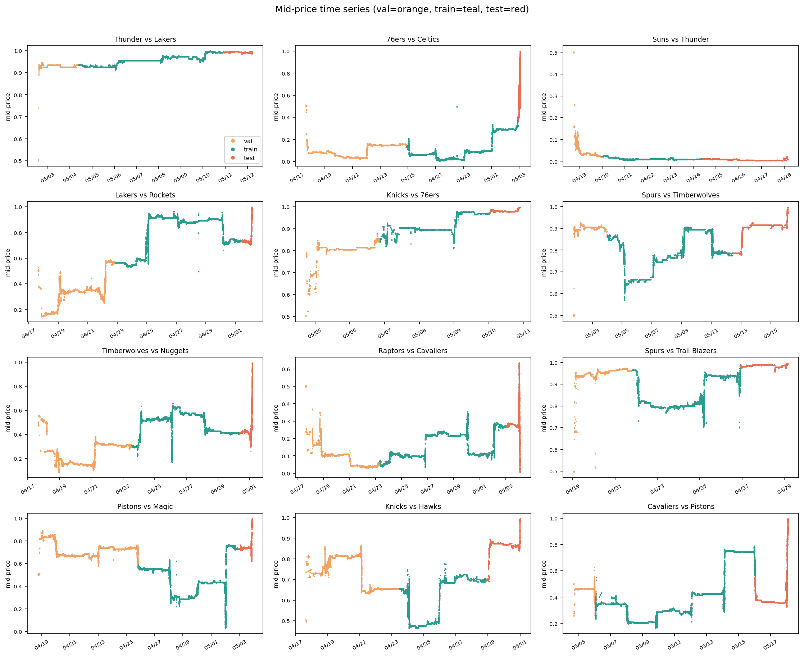
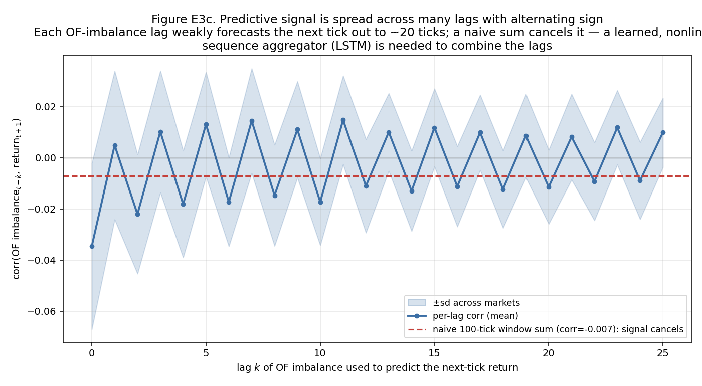
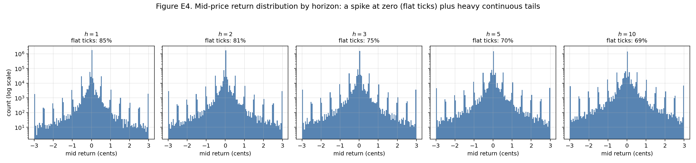
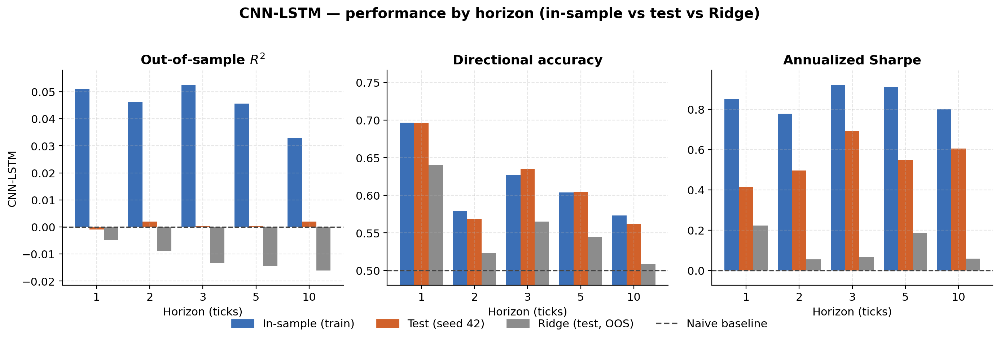
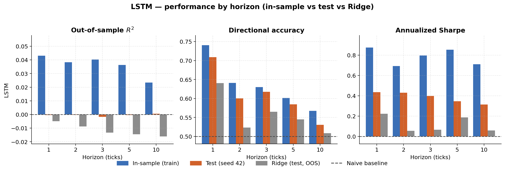
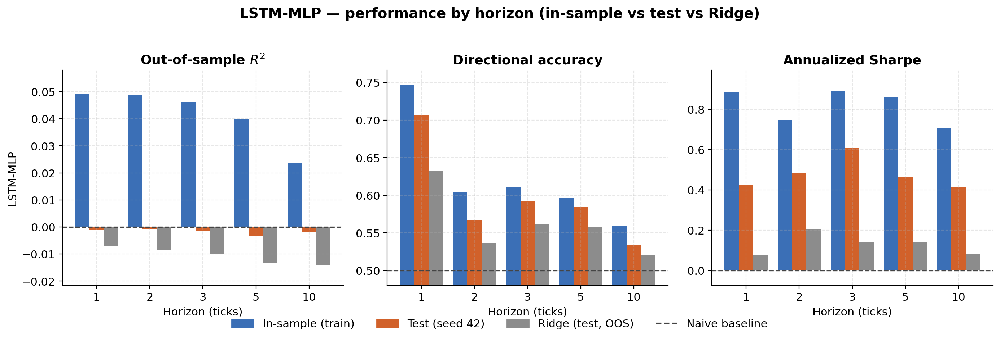
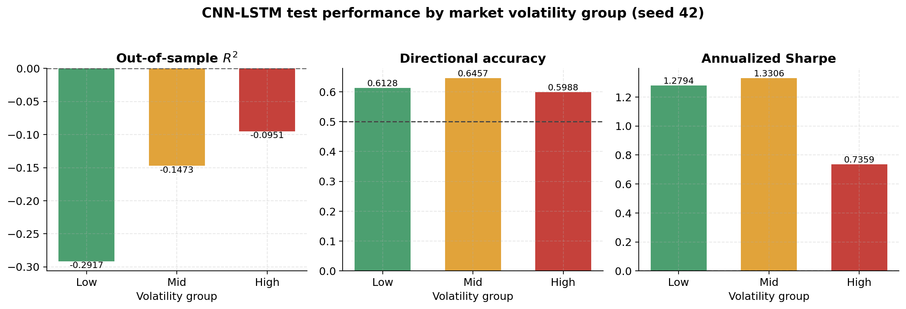

# Deep Order-Flow Imbalance in Prediction Markets: Forecasting Short-Horizon Mid-Price Returns on Polymarket

*Author: Christy Yang, Jing Zou*

---
## 1. Problem and Motivation
Prediction markets have grown over the past several years into a meaningfully sized financial venue. Despite the growing interest, the empirical microstructure of prediction markets remains comparatively understudied. Existing work has focused on aggregate forecast accuracy, calibration, and cross-contract arbitrage (Wolfers and Zitzewitz, 2004; Manski, 2006), with little attention paid to the short-horizon dynamics of the order book itself.

This contrasts sharply with the equity microstructure literature, where deep-learning models have become a standard tool for short-horizon mid-price forecasting from limit order book (LOB) state. Beginning with DeepLOB (Zhang, Zohren and Roberts, 2019) and extended by Kolm, Turiel and Westray (2021) and more recently TLOB (Berti et al., 2025), the consistent finding is that deep models — particularly when fed order flow (OF) features rather than raw book state — recover signal that linear baselines and naive predictors miss. The question this paper investigates is whether that finding transfers from equities to prediction markets. Polymarket's central limit order book is mechanically a standard CLOB, which gives reason to expect some transfer.

Concretely, we study the following problem. For a given Polymarket contract, let $m_t$ denote the mid-price at discrete time step $t$. We forecast multi-horizon mid-price log returns $r_{t,h} = \log(m_{t+h}/m_t)$ for a fixed set of horizons $h \in \mathcal{H}$, using the most recent 100 steps of order flow as input. The forecast target is therefore a vector — an alpha term structure — and the question is whether a deep model trained on this objective achieves measurably better out-of-sample predictive and economic performance than (i) a naive constant predictor calibrated on the training set and (ii) a ridge linear regression on the same feature window. Following the equity microstructure literature, we evaluate along three complementary axes: statistical accuracy ($R^2_{\text{OS}}$), directional accuracy on non-flat ticks, and the annualized Sharpe ratio of a simple sign-following strategy. Positive results would be initial evidence that mature equity-LOB techniques translate to prediction markets; negative or mixed results would themselves be informative about where and why these venues differ.

## 2. Data Description and Preprocessing

The empirical analysis is based on tick-level Level-2 order-book data for Polymarket, a binary prediction-market venue on which each contract settles according to the realized outcome of a real-world event. The data are obtained from the Telonex Polymarket Historical Data API, which records every order-book change over a websocket connection—rather than sampling at fixed intervals—and distributes the resulting snapshots as daily Parquet files.[^telonex] Specifically, we use the `book_snapshot_25` channel, which, according to the Telonex documentation, provides event-driven snapshots of the twenty-five best price levels on each side of the book in a flattened per-level price–size schema;[^telonex] of these we retain the ten best levels per side, yielding a twenty-dimensional book state at each tick. We download the twelve National Basketball Association (NBA) playoff "series-winner" contracts traded over the period April–May 2026 and retain a single tradeable outcome per series. These series-winner contracts are distinct from the more common single-game markets. The NBA playoffs are a four-round tournament in which each matchup is decided by a best-of-seven series: the first team to win four games wins the series and advances, so a series runs anywhere from four to seven games. Polymarket lists a separate game-winner contract for each individual game—at most seven per matchup—whereas the contracts studied here predict which team ultimately wins the series rather than the outcome of any single game.

After the cleaning procedure described below, the working dataset comprises 2,041,832 snapshots, with per-market depth ranging from approximately 39,000 rows (Suns vs. Thunder) to approximately 403,000 rows (Lakers vs. Rockets). 

Each snapshot records the ten best bid levels and the ten best ask levels, together with their prices and sizes. The central object of interest is the mid-price, $\text{mid}*t=\tfrac{1}{2}\big(\text{bid}^0_t+\text{ask}^0_t\big)$, which lies in the unit interval $[0,1]$ and admits a direct interpretation as the market-implied probability of the contract's outcome. The forecasting targets are the forward mid-price changes, or returns, $r*{t,h}=\text{mid}_{t+h}-\text{mid}_t$ for horizons $h\in1,2,3,5,10$ ticks, which are predicted jointly across the five horizons.

Because order-flow features are meaningful only when the mid-price is well defined, a liquidity screen is applied prior to modeling. A contract is admitted only if its tight-spread fraction—the proportion of ticks whose bid–ask spread is below 0.05—is at least 60%. Contracts that fail this criterion exhibit a "hollow midpoint" whose movements reflect quoting artifacts rather than genuine order flow. All twelve contracts satisfy the screen, as documented in the tight-spread column of Table 1.

The raw books are then cleaned through four operations. First, snapshots are strictly time-sorted, since order flow is defined through first differences and therefore requires a monotone time index. Second, the roughly 7–10% of rows that are exact or near-simultaneous duplicates are collapsed to the last observed book state within each microsecond. Third, malformed books—those with a missing best level or an inverted quote, $\text{bid}^0_t\ge\text{ask}^0_t$—are discarded; these constitute between 0.03% and 0.63% of rows per market. Fourth, missing entries at the deeper levels (1–9) are imputed consistently with the order-flow construction, setting a missing bid price to 0, a missing ask price to 1, and any missing size to 0.

The model inputs are order-flow features computed with the three-case scheme of Cont, Kukanov, and Stoikov (2014). For a bid level $i$ with price $b^i_t$ and size $v^i_t$, the bid-side order flow is

$$
\text{OF}^{b,i}_t=\begin{cases} +v^{i}_t & b^{i}*t>b^{i}*{t-1}\quad\text{(new bid)} v^{i}*t-v^{i}*{t-1} & b^{i}*t=b^{i}*{t-1}\quad\text{(size change)} -v^{i}_t & b^{i}*t<b^{i}*{t-1}\quad\text{(bid pulled)},\end{cases}
$$

with the ask side defined symmetrically. Concatenating the ten bid and ten ask levels yields a feature vector $\text{OF}_t\in\mathbb{R}^{20}$ at each tick. The model consumes a look-back window of $W=100$ ticks, so that a single input is a $100\times 20$ matrix; windows are never permitted to cross a market boundary.

Feature normalization proceeds in two stages, applied in a fixed order. Each of the twenty features is first winsorized at its $[0.5,99.5]$ training quantiles—raw order flow spans approximately $\pm 6\times 10^{5}$ with a standard deviation near $1.5\times 10^{4}$, so this step is essential to control outliers—and is then standardized to zero mean and unit variance using per-column training statistics. The targets are standardized analogously, with the consequence that a constant mean predictor attains a standardized mean-squared error of exactly one. Crucially, all four sets of statistics (the winsorization bounds together with the feature and target means and standard deviations) are estimated on the training split alone, so that no future information enters the preprocessing pipeline.

Finally, to support the robustness analysis of Section 8.5, the twelve markets are partitioned into three equal-sized tertiles—Low, Mid, and High—according to realized volatility, defined as $\text{vol}=\text{std}\big(\text{diff}(\text{mid})\big)$. This grouping is a derived property of the same cleaned dataset rather than an additional data source. One feature of the measure merits emphasis: realized volatility captures per-tick jitter rather than the overall travel of the price path; Lakers vs. Rockets, for example, traverses a wide price range yet consists largely of small-step ticks and is therefore classified as Low volatility.

---
## 3. Exploratory Data Analysis

Before modeling, we examine the cleaned data along three axes—the scale and heterogeneity of the contracts, the predictive structure of order flow, and the shape of the prediction target—each of which motivates a specific downstream choice. The figures and the inventory table below are produced by `scripts/eda_report.py` and reuse exactly the cleaning and order-flow construction of Section 2, so the analysis describes precisely the inputs the model consumes.

### 3.1 Scale and heterogeneity of the contracts

Table 1 inventories the twelve contracts. Two facts stand out. First, the markets are highly heterogeneous in size: raw book updates span roughly a factor of nine, from about 45,000 (Suns vs. Thunder) to about 406,000 (Lakers vs. Rockets), and the number of *mid-price changes*—the events the model must actually forecast—is far smaller than the raw update count and varies even more sharply (from under 4,000 to about 68,000). Second, each contract has a finite lifetime of roughly six to seventeen days, terminating at the resolution of the underlying series. The small and uneven per-market sample sizes are the principal motivation for fitting a single **pooled** model across all twelve contracts (Section 4): several markets are individually too short to train a recurrent network on, and pooling amortizes their limited data into one well-populated training set. They also underwrite the variance caveats attached to the smallest markets in the per-market analysis of Section 8.

**Table 1. Per-market data inventory.** "Updates" is the raw number of book updates before cleaning (the cleaning of Section 2 retains 2,041,832 snapshots in total); mid changes, mean spread, and tight-spread fraction are computed on the cleaned books. The settled winner is the team whose contract resolved to 1. "OF turnover" is the total signed order-flow magnitude $\sum_t \sum_i |\text{OF}^{i}_t|$ over the top ten levels—a book-activity proxy in share units, not executed trade volume, which the `book_snapshot_25` channel does not record.

| Market | Settled winner | Updates | Lifetime | Mid changes | Mean spread (¢) | Tight-spread frac. | OF turnover (M sh.) |
|---|---|---:|---:|---:|---:|---:|---:|
| Lakers vs. Rockets | Lakers | 406,120 | 14d 15h | 54,906 | 1.83 | 0.931 | 7,168 |
| Timberwolves vs. Nuggets | Timberwolves | 347,075 | 13d 16h | 24,443 | 2.74 | 0.916 | 4,445 |
| 76ers vs. Celtics | 76ers | 288,151 | 15d 13h | 68,198 | 1.78 | 0.948 | 6,527 |
| Raptors vs. Cavaliers | Cavaliers | 277,046 | 16d 12h | 59,013 | 2.53 | 0.904 | 3,702 |
| Pistons vs. Magic | Pistons | 260,332 | 15d 7h | 32,616 | 2.36 | 0.864 | 4,304 |
| Spurs vs. Trail Blazers | Spurs | 127,975 | 11d 15h | 20,059 | 2.39 | 0.876 | 1,846 |
| Knicks vs. Hawks | Knicks | 126,891 | 13d 12h | 6,590 | 3.16 | 0.862 | 1,284 |
| Spurs vs. Timberwolves | Spurs | 125,728 | 14d 13h | 6,928 | 2.09 | 0.918 | 2,011 |
| Cavaliers vs. Pistons | Cavaliers | 114,162 | 13d 13h | 10,461 | 4.16 | 0.695 | 5,746 |
| Thunder vs. Lakers | Thunder | 52,398 | 9d 18h | 5,039 | 1.05 | 0.999 | 638 |
| Knicks vs. 76ers | Knicks | 49,072 | 6d 9h | 5,482 | 2.07 | 0.930 | 3,651 |
| Suns vs. Thunder | Thunder | 44,636 | 9d 13h | 3,952 | 1.24 | 0.943 | 400 |

The mid-price paths themselves are shown in Figure E1, with each market's series colored by its chronological validation/training/test split. The contracts are qualitatively diverse: some drift nearly monotonically toward resolution (Thunder vs. Lakers), some are volatile throughout (Raptors vs. Cavaliers), some flip decisively near the end (Cavaliers vs. Pistons), and some are short-lived. Across all of them the series are visibly non-stationary, with volatility clustering in bursts rather than holding constant. This non-stationarity is the central reason the data are partitioned **chronologically** rather than at random, and the reason every standardization statistic is estimated per market on the training split alone (Sections 2 and 5); the validation/training/test coloring in the figure makes the time-ordered split explicit. As an aside, the bid–ask spread runs counter to the usual longshot intuition: in these markets it is tightest near resolution (mid near 0 or 1, where the outcome is near-certain and quotes agree) and widest near a 0.5 tossup, with a negative within-market correlation between spread and distance from 0.5 in all twelve contracts.

**Figure E1. Mid-price paths over each contract's lifetime,** colored by the chronological validation (earliest), training, and test (latest) split. The paths are heterogeneous and non-stationary, motivating the per-market chronological split and standardization.

### 3.2 Order flow carries weak, distributed, mean-reverting structure

The motivation for a nonlinear *sequence* model—rather than a linear map or a rule on the single most recent tick—comes from the temporal structure of the order-flow imbalance, defined per tick as the net signed flow $\text{OFI}_t = \sum_i \text{OF}^{b,i}_t - \sum_i \text{OF}^{a,i}_t$. Three observations, taken together, make the case. First, OFI is strongly non-i.i.d. but *anti-persistent*: its autocorrelation is sharply negative at lag one (about $-0.22$ on average) and oscillates around zero for forty or more lags, so consecutive ticks are far from independent. Second, the *predictive* relationship between OFI and future mid-returns is genuine but weak and mean-reverting—the contemporaneous correlation between OFI and the simultaneous mid-move is positive (about $+0.09$), yet the correlation with the *next* tick's return is small and negative (about $-0.03$ across horizons), the signature of a bid–ask bounce in which an imbalance-driven move partially reverts.

Third, and most consequentially for the architecture, this predictive content is spread across many lags with alternating sign and persists for roughly twenty ticks (Figure E2). A naive equal-weight sum of OFI over the 100-tick window therefore very nearly cancels to zero (correlation $\approx -0.007$ with the next return) and is in fact *worse* than using the single most recent tick alone ($\approx -0.035$). In other words, the signal is real but it is nonlinear and distributed through time, so neither a single-tick rule nor a fixed linear aggregation extracts it—which is precisely why the Ridge benchmark of Section 4 fails out of sample, and why a model that *learns* a nonlinear, recency-aware aggregation over the sequence is the appropriate tool. That the recurrent models nonetheless reach roughly 62% directional accuracy (Section 7) is consistent with exactly this reading.

**Figure E2. Predictive signal is distributed across lags with alternating sign.** Each order-flow-imbalance lag weakly forecasts the next-tick return out to ~20 ticks; a naive equal-weight window sum cancels the alternating contributions, so a learned, nonlinear sequence aggregator (the LSTM) is needed to combine them.

### 3.3 The prediction target: a spike at zero with heavy tails

Finally, the distribution of the forecast target itself (Figure E3) shapes how performance must be measured. At every horizon the mid-price return has an enormous point mass at exactly zero—85% of ticks are flat at $h=1$, falling to 69% at $h=10$ as more time elapses—surrounded by a heavy-tailed continuous distribution with discrete pile-ups on the one-cent tick grid. This single picture justifies three decisions made in Sections 2 and 7. The dominant zero-spike is why directional accuracy is scored only on *moved* ticks ($r\neq 0$), since including flat ticks would merely reward predicting zero; the heavy tails at tick resolution are why a genuine edge registers as an out-of-sample $R^2$ of only $10^{-3}$–$10^{-2}$ rather than the much larger values seen in lower-frequency settings; and the wide, ragged scale of the returns is why both features and targets are standardized before training.

**Figure E3. Mid-price return distribution by horizon.** A dominant spike at zero (the flat-tick fraction falls from 85% at $h{=}1$ to 69% at $h{=}10$) plus heavy continuous tails on the penny-tick grid, motivating moved-tick directional accuracy, the small $R^2_{OS}$ scale, and target standardization.

---

## 4. Model description

All the following models studied here share a common input–output interface and differ only in the function class that maps between them. The input to every model is a fixed-length window of the most recent 100 ticks of order flow, each tick a 20-dimensional vector of signed order-flow values across the ten best bid and ten best ask levels; a single example is therefore a $100\times 20$ matrix. The output is a five-dimensional vector of predicted mid-price returns at horizons of $h=1,2,3,5,10$ ticks ahead, produced jointly by a single regression head rather than by five separate models. All models are trained by minimizing the mean-squared error between these predictions and the standardized realized returns, so the task is framed as multi-horizon regression rather than directional classification.

A deliberate modeling choice is that we fit a single, **pooled** model on all twelve contracts jointly rather than a separate per-market model for each. Individual NBA contracts are short-lived—several yield only tens of thousands of ticks—too few to fit a recurrent network reliably on their own, so pooling amortizes the limited per-market data into one well-populated training set and lets the model learn order-flow dynamics shared across contracts. This is coherent because the standardization of Section 2 places order flow and returns on comparable scales across markets that differ widely in price level and liquidity. The cost is that the model cannot specialize to any one market, which we examine in the per-market breakdown of Section 8.5. Prediction windows are formed strictly within a single market and chronological split, so pooling never leaks information across contracts or across the train/validation/test boundary.

### 4.1 LSTM

The simplest forecasting model applies a single recurrent network directly to the order-flow window, with no convolutional preprocessing. The $100\times 20$ sequence is consumed one tick at a time by a single-layer LSTM with hidden dimension 128; the hidden state at the final tick—having integrated information across the entire window—is passed through a linear read-out that emits the five horizon-specific return forecasts jointly. There is no separate feature-extraction stage, so the recurrent cell must learn directly from the raw signed order-flow values. The transformation through the network is summarized in Table 2.

**Table 2. LSTM architecture.**

| Stage | Operation                                                              | Output shape (time × feature) |
| ----- | --------------------------------------------------------------------- | ----------------------------- |
| Input | Order-flow window                                                     | $100\times 20$                |
| LSTM  | One layer, hidden size 128, batch-first; final hidden state retained  | $128$                         |
| Dense | Linear read-out, one value per horizon                               | $5\ (h=1,2,3,5,10)$           |

Following standard practice, the forget-gate bias of the LSTM is initialized near unity to ease gradient flow during the early epochs, and all five horizons are predicted jointly through a single regression head. The network contains 77,445 trainable parameters. This model is the most direct test of whether order-flow features alone, without any convolutional structure, carry forecastable signal.

### 4.2 LSTM-MLP

The LSTM-MLP retains the recurrent trunk of Section 4.1 unchanged and replaces only its linear read-out with a small multilayer perceptron. The final LSTM hidden state of dimension 128 passes through one fully connected hidden layer of width 64 with a ReLU activation, after which a linear layer produces the five horizon forecasts. The head is a strict generalization of the plain linear read-out—removing its hidden layer recovers the LSTM of Section 4.1 exactly—so the model isolates whether a nonlinear transformation of the recurrent representation adds predictive value beyond the recurrent layer itself. The architecture is summarized in Table 3.

**Table 3. LSTM-MLP architecture.**

| Stage    | Operation                                                              | Output shape (time × feature) |
| -------- | --------------------------------------------------------------------- | ----------------------------- |
| Input    | Order-flow window                                                     | $100\times 20$                |
| LSTM     | One layer, hidden size 128, batch-first; final hidden state retained  | $128$                         |
| MLP head | Linear $(128\to 64)$ followed by ReLU                                | $64$                          |
| Dense    | Linear read-out, one value per horizon                               | $5\ (h=1,2,3,5,10)$           |

The forget-gate bias is initialized near unity as before, and the model contains 85,381 trainable parameters—only marginally more than the plain LSTM. As the results show, the additional head leaves performance essentially unchanged, a first instance of the recurring theme that, once informative order-flow features are supplied, added model complexity yields only marginal gains over a plain recurrent model.

### 4.3 CNN-LSTM

The forecasting model is a convolutional–recurrent network that maps the $100\times 20$ order-flow window to a five-dimensional vector of horizon-specific return predictions. The convolutional stack serves as a learned local feature extractor, first across the price levels of the book and then across short spans of tick time; the recurrent layer subsequently integrates the extracted sequence over the full window; and a linear read-out produces the joint forecast. The transformation through the network is summarized in Table 4.

**Table 4. CNN-LSTM architecture.**

| Stage     | Operation                                                                                      | Output shape (time × feature × channel) |
| --------- | ---------------------------------------------------------------------------------------------- | --------------------------------------- |
| Input     | Order-flow window                                                                              | $100\times 20\times 1$                  |
| Block 2a  | Conv $(1\times 2)$, stride $(1\times 2)$, 32 filters (merges each level's bid/ask)             | $100\times 10\times 32$                 |
| Block 2b  | Two Conv $(4\times 1)$, time-axis same-padding, 32 filters (short-term tick patterns)          | $100\times 10\times 32$                 |
| Block 3   | Conv $(1\times 10)$, 32 filters (aggregates the ten levels)                                    | $100\times 1\times 32$                  |
| Inception | Three parallel sub-blocks (3-tick conv, 5-tick conv, max-pool), 64 channels each, concatenated | $100\times 192$                         |
| LSTM      | One layer, hidden size 64; final hidden state retained                                         | $64$                                    |
| Dense     | Linear read-out, one value per horizon                                                         | $5\ (h=1,2,3,5,10)$                     |

Several implementation choices deserve note. Each convolutional block is composed of a two-dimensional convolution followed by batch normalization and a LeakyReLU activation with negative slope 0.01; the batch-normalization layers, which are not part of the original specification, were introduced to stabilize optimization and to prevent the activations from diverging. The forget-gate bias of the LSTM is initialized near unity, following standard practice, to ease gradient flow during the early epochs. The network contains 125,125 trainable parameters and predicts all five horizons jointly through a single regression head. A theme that recurs in the results is that, once informative order-flow features are supplied, the additional convolutional machinery yields only marginal gains over a plain recurrent model.

The model is evaluated against two benchmarks, which serve as references rather than as objects of study in their own right. The first is a naive, no-information predictor whose forecast at every horizon is the training-set mean return; because the targets are standardized on training statistics, this predictor attains a standardized mean-squared error of one and therefore defines the zero line for out-of-sample $R^2$ and the 0.50 line for directional accuracy. The second is a Ridge linear regression, in which the $100\times 20$ window is flattened into a 2000-dimensional feature vector and a ridge model with penalty $\alpha=1$ is fit jointly across the five horizons on up to roughly 40,000 training windows. The Ridge model constitutes a reasonable linear benchmark and a proxy for a linear autoregressive specification with exogenous inputs; as shown below, it over-fits the wide and largely flat input space and is outperformed by the naive predictor out of sample.

---

## 5. Training, Validation, and Testing

This section concerns only the partitioning of the data; the choice of model-fitting hyperparameters and the optimization protocol are treated in Section 4.

The data are divided chronologically within each market. For every contract, the cleaned tick sequence is cut by time into a validation set comprising the earliest 15%, a training set comprising the subsequent 70%, and a test set comprising the most recent 15%. The split is performed independently within each market, because the contracts differ in both length and calendar span, and prediction windows are formed strictly within a single split so that no window straddles a boundary between sets or between markets.

The decision to split chronologically rather than at random is deliberate. A random partition would allow future ticks to enter the training set, introducing look-ahead bias and inflating every performance metric; the chronological cut instead guarantees that all training data precede the test data in time. The ordering of the three sets—validation, then training, then test—is likewise motivated by the non-stationarity of the series. Placing the training set immediately before the test set minimizes the temporal gap between the data on which the weights are fit and the data on which they are evaluated, allowing the model to learn the most recent structure prior to assessment. The validation set is positioned furthest from the test set, which is acceptable precisely because it is used only for model and hyperparameter selection and never to fit weights or to report final results. In summary, the training set fits the parameters, the validation set governs all selection decisions (Section 4), and the test set is consulted exactly once, to produce the reported numbers.

Consistent with this chronological design, the preprocessing pipeline is free of look-ahead: every standardization statistic—the winsorization bounds and the means and variances of both features and targets—is estimated on the training split and then frozen for the validation and test splits, and the naive baseline is similarly defined as the training mean. Prediction windows are sampled at every $s$-th valid tick, where $s$ denotes the stride; an evaluation stride of ten yields approximately 30,500 validation windows and 30,600 test windows, while the training stride is itself a tuned lever controlling data volume (Section 4). Finally, to support the sub-experiment of Section 8.5, the single all-markets model is additionally scored on each market's test segment in isolation, reusing the global standardization and the global naive baseline so that the per-market figures remain mutually comparable.

---

## 6. Hyperparameter Selection

Hyperparameters were chosen through a four-stage search comprising twenty-one runs, with all selection decisions based on a composite score computed on the validation set; the test set played no role in selection. The composite score aggregates the three evaluation metrics, each averaged across horizons, as

$$
\text{score}=2\big(\text{DirAcc}-0.5\big)+\text{Sharpe}+100R^2_{OS}.
$$

The weighting renders the three terms commensurable. Subtracting the chance level of 0.50 from directional accuracy and doubling rescales it to roughly the unit interval; the Sharpe ratio is already of order one; and the out-of-sample $R^2$, which lies near 0.01–0.02 on the validation set, is multiplied by one hundred to bring it onto the same scale as the other two terms.

The search proceeded in stages. The first stage swept the learning rate over $3\times10^{-4},10^{-3},2\times10^{-3}$, the weight decay over $0,10^{-4},10^{-3}$, the hidden size over $64,128$, and the training stride over $25,10$ at a fixed seed. The second stage pursued the most promising directions, increasing the data volume by lowering the training stride to five—yielding approximately 286,000 windows—in combination with the learning rate and model capacity. The final stage re-estimated the two leading configurations across three seeds (0, 7, and 42) to account for the high variance of the Sharpe ratio, and the winner was selected on the seed-averaged validation score.

The search identified a clear winner: a training stride of five with a learning rate of $10^{-3}$ and a hidden size of 64, which attained a validation score of $2.710\pm0.126$ and thereby surpassed the runner-up configuration (stride 10, learning rate $2\times10^{-3}$, score $2.625\pm0.147$) while also exhibiting greater stability. Three findings emerged from the search. First, data volume was the dominant lever: reducing the training stride from 25 to 5 quadrupled the number of training windows, from roughly 57,000 to 286,000, and produced the largest and most consistent validation gains. Second, regularization conferred no benefit, as zero weight decay was optimal, which is consistent with the view that the train–test gap reflects distributional shift rather than over-fitting. Third, the learning rate of $10^{-5}$ used in the original Nasdaq study proved far too small in this setting, leaving the training loss nearly unchanged and never triggering early stopping; raising the learning rate to $10^{-3}$ and enlarging the dataset resolved this under-training pathology.

The complete set of hyperparameters and optimizer settings for the final model, held fixed across the search except where noted as a tuned lever, is recorded in Table 5.

**Table 5. Frozen winning configuration: hyperparameters and optimizer.**

| Category         | Hyperparameter                            | Value                          |
| ---------------- | ----------------------------------------- | ------------------------------ |
| Data / windowing | Look-back window $W$                      | 100 ticks                      |
| Data / windowing | Training stride                           | 5 (≈ 286k windows)             |
| Data / windowing | Evaluation stride                         | 10                             |
| Data / windowing | Maximum training windows (cap)            | 0 (no cap)                     |
| Data / windowing | Target standardization                    | z-score on training statistics |
| Model            | LSTM hidden size                          | 64                             |
| Model            | Convolutional filters                     | 32                             |
| Model            | Inception filters                         | 64                             |
| Model            | Batch normalization in conv blocks        | Enabled                        |
| Model            | Trainable parameters                      | 125,125                        |
| Optimizer        | Optimizer                                 | Adam                           |
| Optimizer        | Learning rate                             | $10^{-3}$                      |
| Optimizer        | Weight decay                              | 0                              |
| Optimizer        | Loss function                             | MSE (standardized targets)     |
| Optimizer        | Gradient clipping (max-norm)              | 1.0                            |
| Training         | Batch size                                | 256                            |
| Training         | Maximum epochs                            | 60                             |
| Training         | Early-stopping patience (validation loss) | 6                              |
| Training         | Random seed                               | 42                             |

Early stopping monitors the validation loss and restores the best-validation weights before the model is evaluated on the test set, and all predictions are returned to raw return units before metrics are computed. Training was performed on a Modal H100 accelerator, with results logged to `results/experiments.jsonl` and `results/runs/*.json`. The training and validation loss trajectories for the winning seed-42 run are displayed in Figure 1 (`fig_loss_curve.png`), which plots the standardized mean-squared error against the epoch index, marks the best-validation epoch, annotates the early-stopping epoch, and includes a dashed reference at the mean-predictor baseline of one. The approximately threefold gap between training and validation loss does not represent classical over-fitting—weight decay did not narrow it—but rather reflects the non-stationarity between the training and validation periods.

---

## 7. Performance Evaluation

### 7.1 Evaluation Metrics

Model performance is assessed with three complementary metrics, each computed after predictions are returned to raw return units. The first is the out-of-sample coefficient of determination, defined relative to the naive train-mean predictor as $R^2_{OS}=1-\text{MSE}*{\text{model}}/\text{MSE}*{\text{naive}}$. A positive value indicates that the model improves upon always predicting the average; at tick resolution, values on the order of $10^{-3}$ to $10^{-2}$ already signal a genuine edge, whereas a value near 0.5 would be symptomatic of information leakage. The second metric is directional accuracy, $\text{DirAcc}=\text{mean}\big(\mathbb{1}[\text{sign}(\hat r)=\text{sign}(r)]\big)$, evaluated only over moved ticks ($r\neq 0$); the large mass of flat ticks is excluded because scoring it would merely reward the prediction of zero, and the chance baseline for the metric is 0.50. The third metric is the annualized Sharpe ratio of a frictionless unit-position strategy, in which the per-tick profit is $\text{pnl}_t=\text{sign}(\hat r_t)r_t$ and $\text{Sharpe}=\big[\text{mean}(\text{pnl})/\text{std}(\text{pnl})\big]\sqrt{252}$; this measure is the noisiest of the three across random seeds. Throughout, the model is compared against the naive and Ridge benchmarks introduced in Section 2.

### 7.2 Performance by Horizon

The horizon-level behavior of each model is presented in a dedicated figure containing three panels, one for each metric: Figure 2 for the CNN-LSTM (`fig_perf_cnn_lstm.png`), Figure 3 for the LSTM (`fig_perf_lstm.png`), and Figure 4 for the LSTM-MLP (`fig_perf_lstm_mlp.png`). Within each panel the horizontal axis indexes the forecast horizon over $1,2,3,5,10$, and the three bars at each horizon report, respectively, the model's in-sample performance, its test performance at seed 42, and the corresponding out-of-sample Ridge benchmark, with reference lines drawn at $R^2=0$ and $\text{DirAcc}=0.5$. The vertical axes are held to a common range across the three figures so that the models may be compared directly. A consistent pattern emerges. The gap between in-sample and test performance is pronounced for $R^2_{OS}$, indicating that the networks over-fit in the squared-error sense, yet it is modest for directional accuracy and the Sharpe ratio, indicating that the directional component of the signal generalizes. Among the three architectures, the CNN-LSTM sustains the highest test bars at the near horizons and is the only model to achieve a positive out-of-sample $R^2$.

### 7.3 In-Sample versus Out-of-Sample Comparison

Table 6 (`table_c_in_vs_out.png`) reports the horizon-averaged metrics for the three neural models and the two benchmarks, distinguishing in-sample performance on the training split from out-of-sample performance on the test split at seed 42. The neural models over-fit only modestly on directional accuracy and the Sharpe ratio—their in-sample and test values are close, which suggests that the directional signal is genuine rather than memorized—whereas their out-of-sample $R^2$ declines from approximately $+0.04$ in sample toward zero or slightly negative values out of sample, consistent with the train-to-test distributional shift. The CNN-LSTM is the only model with a positive test $R^2_{OS}$ ($+0.0007$) and is best or tied on every test-set metric, with a test directional accuracy of 0.6134 and a test Sharpe ratio of 0.5514; averaged across seeds, its test performance is $R^2=0.0017\pm0.0007$, $\text{DirAcc}=0.6225\pm0.0068$, and $\text{Sharpe}=0.5666\pm0.033$.

The Ridge benchmark is reported both in and out of sample, and its behavior is instructive. Its $R^2_{OS}$ is more negative in sample ($-0.0484$) than out of sample ($-0.0115$). This apparent paradox follows from the definition of $R^2_{OS}$ relative to the naive train-mean predictor: because that baseline is an especially strong reference on the very window from which its mean is computed, a flat linear fit over 2000 noisy inputs is outperformed by it more decisively in sample than out of sample. The Ridge model's directional metrics scarcely change between the two regimes (a directional accuracy of 0.559 in sample versus 0.557 out of sample), confirming that the linear model carries little genuine signal in either case. The naive predictor is included as the definitional baseline, with $R^2_{OS}=0$, directional accuracy 0.50, and a Sharpe ratio of zero.

---
## 8. Results and Interpretation
### 8.1 The order-flow signal is real and beats both baselines

Table 7 shows the out-of-sample results. The central finding is positive: every neural model trained on order-flow features clears both reference points. All three reach directional accuracy of roughly 0.60–0.61 on moved ticks—well above the 0.50 chance level and above the Ridge benchmark's 0.557—and positive annualized Sharpe ratios of 0.39–0.55, against the naive predictor's zero and Ridge's 0.12. The tuned CNN-LSTM is strongest on every test metric: directional accuracy 0.6134, Sharpe 0.5514, and the only strictly positive out-of-sample $R^2$ (+0.0007 at seed 42; seed-averaged +0.0017 ± 0.0007, positive on four of five horizons). The Ridge benchmark, by contrast, posts a *negative* $R^2_{OS}$ (−0.012): a linear model over the flattened 2,000-dimensional window over-fits the wide, largely flat input space and is beaten out of sample by simply predicting the training-mean return.

**Table 7. Cross-model out-of-sample performance** (test split, seed 42; mean over the five horizons $h=1,2,3,5,10$). Higher is better for all three metrics.

| Model | $R^2_{OS}$ | Directional acc. | Sharpe (ann.) | Parameters |
|---|---:|---:|---:|---:|
| Naive (train-mean) | 0.0000 | 0.500 | 0.000 | — |
| Ridge linear benchmark | −0.012 | 0.557 | +0.118 | — |
| LSTM (single layer) | −0.0005 | 0.6085 | +0.385 | 77,445 |
| LSTM-MLP | −0.0017 | 0.5969 | +0.478 | 85,381 |
| **CNN-LSTM (tuned)** | **+0.0007** | **0.6134** | **+0.5514** | 125,125 |

*CNN-LSTM seed-averaged test (three seeds): $R^2_{OS}=+0.0017\pm0.0007$, DirAcc $=0.6225\pm0.0068$, Sharpe $=0.5666\pm0.033$.*

Economically, this shows that the order-flow imbalance carries genuine, exploitable information about the next few mid-price moves in Polymarket NBA contracts—the same signal documented on Nasdaq equities, now shown to appear in a market that prices probabilities rather than dollars. An $R^2_{OS}$ on the order of $10^{-3}$ is what microstructure theory predicts at tick resolution, where almost all of the return variance is unforecastable noise and only a thin, persistent drift is recoverable from recent liquidity changes; a value anywhere near 0.5 would signal a data leak, not skill. 

Figures 2–4 break this comparison down by horizon for each neural model. In every panel the three bars at each horizon report, respectively, in-sample performance, test performance at seed 42, and the out-of-sample Ridge benchmark, with common vertical axes across the three figures so the models can be read against one another directly.

**Figure 2. CNN-LSTM, performance by horizon.** Out-of-sample $R^2$ (left), directional accuracy (center), and annualized Sharpe (right). The CNN-LSTM sustains the highest test bars at the near horizons and is the only model whose out-of-sample $R^2$ is positive; the in-sample-to-test gap is pronounced for $R^2$ but modest for directional accuracy and Sharpe.

**Figure 3. LSTM, performance by horizon.** The plain single-layer LSTM nearly matches the CNN-LSTM on directional accuracy at $1.6\times$ fewer parameters, with the same near-tick concentration of skill.

**Figure 4. LSTM-MLP, performance by horizon.** Adding a nonlinear MLP head to the recurrent trunk leaves performance essentially unchanged relative to the plain LSTM (Figure 3), confirming that the gain comes from the order-flow representation rather than head complexity.

### 8.2 Architectural complexity adds little once order flow is used

The second finding concerns parsimony. Although the CNN-LSTM is best, its margin over a plain single-layer LSTM is slight: 0.6134 versus 0.6085 directional accuracy, with the LSTM achieving this at $1.6\times$ fewer parameters (77k versus 125k) and no convolutional stack at all. The LSTM-MLP, which inserts a nonlinear head between the recurrent trunk and the read-out, buys nothing over the plain LSTM—its directional accuracy is in fact marginally lower (0.5969). This reproduces the headline conclusion of Kolm, Turiel and Westray directly: once informative order-flow features are supplied, a simple recurrent model captures most of the available signal, and added architecture yields only marginal gains.

The business reading is clean. The value resides in the *feature representation*—signed, level-resolved order flow—not in deep architecture, so the cheaper model is the sensible production choice.

### 8.3 Predictability is concentrated at the nearest tick

The third finding is about *where in the horizon term structure* the signal lives. For the CNN-LSTM, directional accuracy is highest at the nearest horizon—0.696 at $h=1$—and decays to 0.562 at $h=10$, with the intermediate horizons falling in between (Figure 2, center); the plain LSTM shows the same shape even more sharply (0.709 at $h=1$ down to 0.531 at $h=10$), as does the LSTM-MLP (0.706 to 0.535). The immediate next move is by far the most forecastable from recent order flow—the prediction-market echo of the equity finding that microstructure alpha decays after only a couple of price changes. The Sharpe ratio, by contrast, shows no comparably clean horizon trend (the CNN-LSTM's per-horizon Sharpe ranges over roughly 0.42–0.69 with no monotone pattern), because a unit position is taken at every horizon and the metric mixes directional skill with the per-horizon return scale; we therefore read the horizon structure off directional accuracy rather than Sharpe.

The economic implication compounds the parsimony point of Section 8.2: because the edge is concentrated at $h=1$ and fades within a handful of ticks, it must be harvested almost immediately. Any latency between signal and execution, or any holding period stretched beyond a few ticks, erodes the very horizons where the model is most confident—which is why a cheap, low-latency model that acts on the next tick is the operationally correct choice.

### 8.4 The squared-error edge is fragile, and the Sharpe is frictionless

Two cautionary findings temper the picture. First, the squared-error edge does not survive out of sample as cleanly as the directional one. For the LSTM and LSTM-MLP the *validation* $R^2_{OS}$ (+0.015 and +0.012) collapses to essentially zero on the test split (−0.0005 and −0.0017); even the CNN-LSTM falls from a validation +0.0159 to a test +0.0007. This is not classical over-fitting—weight decay never helped in the hyperparameter search (Section 6), the training loss falls smoothly, and the in-sample-to-test gap on *directional* accuracy is modest—but rather non-stationarity between the training and test periods. In prediction markets this is structural rather than incidental: as a best-of-seven series unfolds, information arrives in discrete jumps (game results, injury news, rotation changes) and the probability path's dynamics shift, so a model fit on earlier ticks genuinely faces a different test distribution. The practical reading is that the recoverable edge is *directional, not magnitude*: the sign of the next move generalizes (directional accuracy holds up out of sample), while the calibrated size of the move does not (the $R^2_{OS}$ collapses). A deployable strategy should accordingly size positions by predicted sign, not by predicted return magnitude.

Second, and decisive for any economic claim, the reported Sharpe ratios are *frictionless*. The strategy takes a one-unit position in the predicted direction at every tick and pays nothing to enter or exit. The ~0.55 annualized Sharpe is therefore best read as evidence that order flow contains *predictive information*, not as a claim that this particular sign-following rule is profitable as written. Converting the signal into net economic value would require harvesting it far more selectively, such as acting only on the highest-confidence ticks, using passive limit orders rather than marketable ones, or holding across several ticks to amortize the spread. Any of these streategies would trade hit-rate for lower cost. We therefore treat the frictionless figures as an *upper bound* on deployable performance, not a measurement of it.

### 8.5 Robustness to Market Volatility

A question we ask is whether the performance of the single all-markets meta model depends on the price-curve volatility of the underlying contract. In other words, we want to investigate whether the meta model performs better on markets with higher volatility in mid-prices.

We therefore ask whether performance varies systematically with volatility ($H_0$: it is independent of volatility; $H_1$: it improves or degrades on high- or low-volatility markets). The twelve markets are grouped into Low, Mid, and High tertiles by realized volatility—the per-tick standard deviation of mid-price changes over each contract's life—and the single trained model is evaluated on each market's test segment, reusing the global standardization and naive baseline of Section 5. We then compare the three groups' mean performance on each metric.

The group means are displayed in Figure 5 and tabulated, in both simple and window-weighted form, in Table 8. Directional accuracy is nearly flat across the three groups, remaining within 0.60–0.65; the Sharpe ratio is somewhat lower for the High-volatility group; and the out-of-sample $R^2$ is negative in every group and exhibits no monotonic trend.

**Figure 5. CNN-LSTM test performance by volatility tertile (seed 42).** Directional accuracy (center) is flat across the Low/Mid/High groups; Sharpe (right) dips for the High group but with overlapping spread; per-market $R^2_{OS}$ (left) is negative in every group—a baseline artifact on short, quiet test segments (see text), not a loss of directional skill.

**Table 8. CNN-LSTM test metrics by volatility tertile** (seed 42, four markets per group). Each market is scored on its own test segment, then averaged within group; "(w)" denotes the window-weighted mean.

| Group | $R^2_{OS}$ | DirAcc | Sharpe | $R^2_{OS}$ (w) | DirAcc (w) | Sharpe (w) |
|---|---:|---:|---:|---:|---:|---:|
| Low (n=4) | −0.292 | 0.613 | 1.279 | −0.190 | 0.601 | 0.946 |
| Mid (n=4) | −0.147 | 0.646 | 1.331 | −0.043 | 0.653 | 1.383 |
| High (n=4) | −0.095 | 0.599 | 0.736 | −0.073 | 0.607 | 0.771 |

Two readings follow. First, the model's core predictive skill is robust to volatility: directional accuracy stays in the 0.60–0.65 band across the Low, Mid, and High groups, and the Sharpe ratio—though somewhat lower for the High group—remains comfortably positive in every group. The model's ability to call the direction of the next move and to earn a risk-adjusted return therefore does not vary systematically with the shape of the price curve, and we find no evidence against $H_0$. Second, the out-of-sample $R^2$ is negative in *every* group, which is a property of the metric rather than a sign that the model fails on these markets. Because $R^2_{OS}$ is measured relative to each market's own naive train-mean predictor, a short and quiet test segment makes that baseline especially hard to beat and pushes the ratio negative; per-market $R^2_{OS}$ therefore reflects how quiet a market's test window happens to be more than how well the model predicts it, and directional accuracy and the Sharpe ratio are the more reliable cross-market metrics.

---
## 9. Limitations and Conclusion

### 9.1 Limitations

Four limitations bound the scope of our conclusions and motivate the directions we would pursue next.

**Pooled, not per-instrument.** Where Kolm, Turiel and Westray fit a separate model for each instrument, we fit a single model pooled across all twelve contracts (Section 4). This is a direct consequence of the data: individual NBA series are short-lived—several yield only tens of thousands of usable ticks—too few to train a recurrent network reliably on their own, so pooling amortizes the limited per-market data into one well-populated training set. The cost is faithfulness: a pooled model learns order-flow dynamics that are common across contracts and cannot specialize to the idiosyncrasies of any one of them. The robustness analysis of Section 8.5 suggests the pooled model's directional skill does not vary systematically across markets, which is mild evidence that pooling is not badly mis-specified here, but it remains a compromise that a richer per-market dataset would not require.

**Narrow scope.** Twelve NBA series-winner contracts over a single playoff window (April–May 2026) is a narrow slice of the prediction-market universe, and the regularities we document may be specific to it. Sports-resolution markets have a particular structure—a fixed, known resolution date and information that arrives in discrete game-by-game jumps—that need not generalize to other venues. Future work should test whether the same order-flow signal appears in other sports, and, more interestingly, in markets with very different information dynamics such as politics, macroeconomic releases, or crypto event markets, where news arrives continuously and resolution timing is itself uncertain.

**Contract maturity is ignored.** Because the splits are chronological, our test data are always the ticks closest to the payout date, and the model is therefore evaluated on a systematically later—and more volatile—regime than it was trained on. The standardized loss gap is the symptom: training loss settles near 0.9 while validation and test loss sit near 3.5, indicating that the hold-out period is materially more volatile than the training period (Section 8.4). This is not merely sampling noise but a likely shift in the data-generating process: when a contract first lists, the outcome is distant and uncertain and the mid drifts on slow news; as it approaches resolution, the outcome becomes increasingly determined, the mid is pushed toward 0 or 1, and order flow becomes more one-sided. The model treats a tick the same regardless of how close the contract is to payout. Future work could make the model maturity-aware—adding time-to-resolution as a feature, conditioning on it, or fitting separate models by maturity bucket—so that the differing dynamics of early and late life are modeled rather than averaged over.

**Frictionless P&L.** As emphasized in Section 8.4, the Sharpe ratio is computed for a strategy that takes a unit position in the predicted direction every tick and pays nothing to trade. Polymarket spreads in these contracts are wide—roughly 0.007 to 0.020 on the unit price scale—while the per-tick mid return is a small fraction of a cent, so a rule that flips on every tick would not survive realistic fees, slippage, and spread-crossing costs. The reported Sharpe is therefore best read as a signal-quality readout, not a backtest of a deployable strategy. A genuine economic evaluation would require a cost-aware backtest with passive (limit-order) execution and selective trading on the highest-confidence ticks, which we leave to future work.

### 9.2 Conclusion

This paper asked whether the deep order-flow forecasting techniques developed on equity limit order books transfer to prediction markets, using twelve Polymarket NBA series-winner contracts as a test bed. To our knowledge it is the first application of order-flow deep learning to a prediction-market venue. The answer is a qualified yes. All three neural models trained on signed order-flow features beat both a naive constant predictor and a Ridge linear benchmark on every metric, attaining roughly 61% directional accuracy on moved ticks and a small but genuinely positive out-of-sample $R^2$ for the tuned CNN-LSTM—exactly the thin, low-signal-to-noise edge that microstructure theory predicts at tick resolution. The paper's two headline structural findings reproduce in this new venue: a plain single-layer LSTM nearly matches the far larger CNN-LSTM, so the value lies in the order-flow representation rather than in architectural depth; and predictability is concentrated at the nearest tick and decays quickly with the horizon.

The transfer, however, is established at the level of *signal*, not of realized profit. The squared-error edge is fragile out of sample, reflecting the non-stationarity inherent to contracts that march toward a fixed resolution, and the economic metrics are frictionless. The robust, generalizing component of the signal is directional rather than magnitude-based. Taken together, the results are encouraging evidence that mature equity-microstructure methods carry real information into prediction markets—a rapidly growing but empirically understudied venue—while making clear that turning that information into net economic value requires the maturity-aware modeling and cost-aware evaluation we have outlined as future work.

---
## References

Berti, L., et al. (2025). *TLOB: A transformer-based model for predicting price trends from limit order book data.* arXiv preprint.

Cont, R., Kukanov, A., & Stoikov, S. (2014). The price impact of order book events. *Journal of Financial Econometrics*, 12(1), 47–88.

Kolm, P. N., Turiel, J., & Westray, N. (2021). *Deep order flow imbalance: Extracting alpha at multiple horizons from the limit order book.* SSRN working paper. (Published in *Mathematical Finance*, 33(4), 1044–1081, 2023.)

Manski, C. F. (2006). Interpreting the predictions of prediction markets. *Economics Letters*, 91(3), 425–429.

Wolfers, J., & Zitzewitz, E. (2004). Prediction markets. *Journal of Economic Perspectives*, 18(2), 107–126.

Zhang, Z., Zohren, S., & Roberts, S. (2019). DeepLOB: Deep convolutional neural networks for limit order books. *IEEE Transactions on Signal Processing*, 67(11), 3001–3012.

**Data source.**

[^telonex]: Telonex, *Polymarket Historical Data API*, order-book channel documentation (`book_snapshot_5`, `book_snapshot_25`, and `book_snapshot_full`). The `book_snapshot_25` channel returns event-driven, tick-by-tick snapshots of the top twenty-five levels on each side of the book in a flattened price/size schema, captured on every book update over websocket and delivered as daily Parquet files. Available at [https://telonex.io](https://telonex.io) (accessed June 2026).